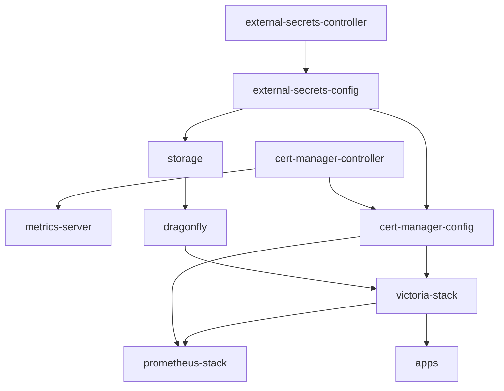

# Monitoring cluster dependencies

This directory defines the Flux Kustomizations for the monitoring cluster.
The arrows below point from a dependency to the Kustomization that depends on
it. Flux waits for a dependency to become ready before reconciling the next
Kustomization.

## Kustomization sources

| Kustomization | Path |
| --- | --- |
| `cert-manager-controller` | `flux/infrastructure/cert-manager/controller/overlays` |
| `metrics-server` | `flux/infrastructure/metrics-server/overlays` |
| `external-secrets-controller` | `flux/infrastructure/external-secrets/controller/overlays` |
| `external-secrets-config` | `flux/infrastructure/external-secrets/config/overlays/monitoring` |
| `storage` | `flux/infrastructure/storage/overlays/monitoring` |
| `cert-manager-config` | `flux/infrastructure/cert-manager/config/overlays` |
| `dragonfly` | `flux/infrastructure/dragonfly/overlays` |
| `victoria-stack` | `flux/infrastructure/victoria-stack/overlays` |
| `prometheus-stack` | `flux/infrastructure/prometheus/overlays/monitoring` |
| `apps` | `flux/apps/monitoring` |

The monitoring cluster loads these definitions from `infrastructure.yaml` and
`apps.yaml` through `kustomization.yaml`.
